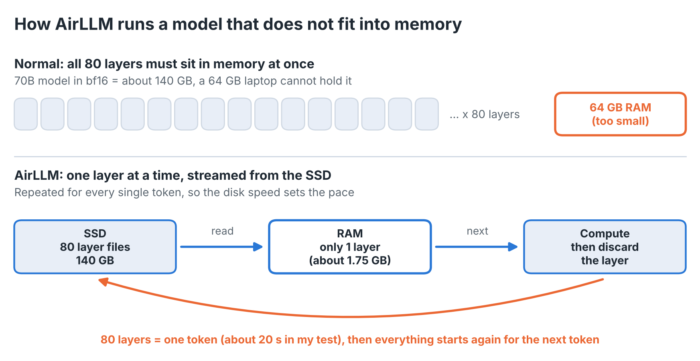
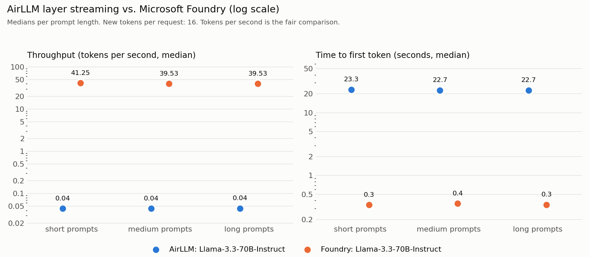

# I ran Llama 70B on a MacBook: 900 times slower than Microsoft Foundry

AirLLM lets you run a 70 billion parameter model on a 64 GB MacBook by loading one layer at a time from disk. It works. It is also about 900 times slower than the same model in Microsoft Foundry. An answer with 200 tokens takes more than an hour locally and a few seconds in the cloud. That makes AirLLM a great tool for offline experiments and a poor one for anything interactive. This post shows the measurements, four pitfalls from the Foundry side and a simple rule for choosing between both.

All code, raw data and the Bicep template are in the repo: [https://github.com/Frezz146/airllm-vs-foundry](https://github.com/Frezz146/airllm-vs-foundry)

**900x**

slower than Foundry for the same model (0.044 versus about 40 tokens per second)

**22.7 s vs 0.34 s**

until the first token appears, local versus Foundry

**0.71 USD**

per million input and output tokens in Foundry (Global Standard)

> **Why 70B?** My first attempt used an 8B model. It fits into RAM, so AirLLM was never really tested and the comparison told me very little. AirLLM only makes sense for a model that is larger than your memory, so I repeated everything with Llama 3.3 70B on both sides.

**Quick glossary for non technical readers**

- **Token:** a chunk of text, roughly three quarters of a word. Models read and write in tokens.
- **Time to first token:** how long you wait until the answer starts to appear.
- **Tokens per second:** how fast the answer is written. 40 tokens per second feels like fast typing, 0.044 means one word every 30 seconds.
- **70B and bf16:** 70 billion parameters, each stored in 2 bytes, which adds up to about 140 GB.
- **Layer:** the model is a stack of 80 identical processing steps. Every token has to pass through all of them.

## The idea behind AirLLM

A large language model is a stack of layers. Normally all of them must fit into memory (or GPU memory) at once. A 70B model in bf16 needs about 140 GB, far more than a laptop has.

AirLLM avoids this by keeping only one layer in memory. For every token it reads the first layer from disk, computes, throws it away, reads the next one and so on until all 80 layers are done. Then the next token starts again. Memory is no longer the limit, disk speed is.



*AirLLM trades memory for disk reads: all 80 layers are streamed from the SSD for every generated token.*

## The setup

I wanted a fair comparison, so both sides run the same model: **Llama 3.3 70B Instruct**.

- **Local:** MacBook Pro 16 inch with Apple silicon (M5 Max, 64 GB RAM, 2 TB SSD), AirLLM on the MLX backend, model from an ungated Hugging Face mirror.
- **Cloud:** Microsoft Foundry, Global Standard deployment in Sweden Central, Entra ID authentication only, deployed with Bicep and a small shell script that can also tear everything down again.
- **Workload:** three prompts (short, medium and long), 16 new tokens each, temperature 0. Foundry got 5 runs per prompt, AirLLM 2 because every run takes six minutes.

## The results

| Metric (median) | AirLLM, local | Foundry |
|---|---|---|
| Time to first token | 22.7 to 23.3 s | 0.34 to 0.36 s |
| Total time for 16 tokens | about 361 s | about 0.4 s |
| Throughput | 0.044 tokens/s | about 40 tokens/s |
| One time setup | 79 min (download and layer split) | a few minutes (deployment) |
| Cost | electricity and hardware | 0.71 USD per 1M input and output tokens |



*Medians per prompt length, 16 new tokens, both axes logarithmic. Same model on both sides: Llama 3.3 70B Instruct.*

A few things stand out:

- **Every token costs a full pass over the model**. About 20 seconds per token matches 140 GB read from the SSD at roughly 7 GB/s. The chip is not the bottleneck, the disk is.
- **Prompt length barely matters** for short prompts, because the cost is dominated by loading the layers.
- **A 200 token answer would take more than an hour** locally. In Foundry it takes a few seconds.
- **The cloud side is cheap.** Llama 3.3 70B in the Global Standard deployment costs 0.71 USD per million input and output tokens (Azure Retail Prices API, Sweden Central, checked on 6 October 2026). My 15 benchmark requests with about 59 input and 16 output tokens cost less than a tenth of a cent in total. Generating one million tokens locally at 0.044 tokens per second would take about 260 days.

## What I learned on the Foundry side

The benchmark itself taught me more than the numbers. Four pitfalls are worth knowing:

1. **Silent retries distort latency**: In an earlier test with a smaller model (gpt-5-mini) and a deployment capacity of 10, my time to first token jumped to about 5 seconds. The cause was throttling (HTTP 429) combined with automatic retries in the SDK, which hide the problem inside the timing. I now disable SDK retries in the benchmark, wait for the retry hint outside the timed section and count throttled attempts separately.
2. **Check quota before you deploy**: The Llama 3.3 70B quota in my subscription was 20 (thousand tokens per minute). My first deployment asked for 50 and the what-if validation rejected it. Running what-if before every deployment saved me from a half-created resource.
3. **The catalog and your account can disagree**: The model catalog listed version 10. My account offered versions 1 to 5 and 9. Ask the account itself with `az cognitiveservices account list-models` instead of trusting the web page.
4. **Not every model takes the same parameters**: Reasoning models such as gpt-5-mini need `max_completion_tokens` and accept a reasoning effort setting. For Llama through the OpenAI compatible v1 endpoint I simply left the reasoning setting out. If a call fails with HTTP 400, check what that specific deployment accepts.

## Which one should you use?

| Situation | AirLLM | Foundry |
|---|---|---|
| Offline prototype, no cloud allowed | works, slowly | not possible |
| Overnight batch with short outputs | possible if time is free | faster and cheap per token |
| Interactive chat or an agent | not usable | suitable |
| Many parallel users | one request at a time | scales with quota |
| Data must not leave the machine | fits | Data Zone or Regional deployment instead of Global, plus network isolation |
| Model larger than your memory | the real use case | managed models only |

Data residency is not free in the cloud, but it is cheap. For Llama 3.3 70B in Sweden Central the list price per million tokens is 0.71 USD for Global Standard, 0.781 USD for Data Zone and 0.859 USD for Regional deployments (Azure Retail Prices API, checked on 6 October 2026). Data Zone and Regional deployments are the ones meant for stricter data residency requirements. Only a fully offline setup like AirLLM keeps the data on the machine for certain.

My rule of thumb: use AirLLM when the constraint is "this must run here" and time does not matter. Use Foundry as soon as a human waits for the answer or more than one request arrives at a time.

## What this means in practice

- **Develop small, run big**: Test prompts and code against a small local model and run production in Foundry.
- **Use AirLLM for the exceptions**: A one off analysis, a demo without internet or a model that must stay on this machine and time does not matter.
- **Choose the deployment type by your data rules**: Global, Data Zone and Regional differ by a few cents per million tokens, not by orders of magnitude.
- **Check quota, model version and parameters before a demo**: The catalog and your account can disagree.

## macOS, NVIDIA and what changes

I ran everything on a MacBook with Apple silicon, so AirLLM used its MLX backend. That has a few consequences:

- On macOS only Llama architecture models work, which is why Llama was the natural choice for both sides.
- There is no stop token handling, answers can repeat until the token limit is reached. It does not affect the timing.
- The first run downloads the model and splits it into one file per layer. For 70B that took 79 minutes and needs about twice the model size in free disk space, roughly 285 GB.

On a machine with an NVIDIA GPU the local numbers will look different, for example with the torch backend or 4 bit compression. I would still expect the same conclusion. The gap to the cloud is about 900 times, so even a setup that is ten times faster would be about 90 times slower than the Foundry deployment and every token still needs a full pass over the layers from disk. This is an expectation based on the size of the gap, I did not measure it on NVIDIA hardware.

## Conclusion

AirLLM is a clever trick that makes a 70B model run on a laptop. Foundry is what you use as soon as someone waits for the answer. The gap I measured is about 900 times for this model on this machine, which is too large for a faster computer to change the decision.

If you own an NVIDIA GPU I would like to see your numbers. The benchmark is in the repo and a pull request with a new results file is all it takes.

[View the repo on GitHub](https://github.com/Frezz146/airllm-vs-foundry)

## Try it yourself

> **Before you start**
>
> - About 285 GB of free disk space for the 70B model (download plus split layer files)
> - Azure CLI signed in with `az login` on the right tenant
> - Quota for Llama 3.3 70B in your region (mine was 20 thousand tokens per minute)
> - Python 3.12 and uv, see the README in the repo
> - Run `scripts/foundry.sh destroy` when you are done

```bash
git clone https://github.com/Frezz146/airllm-vs-foundry
cd airllm-vs-foundry
scripts/foundry.sh deploy -m Llama-3.3-70B-Instruct --model-format Meta --model-version 9 -d bench-llama --capacity 20

# run the benchmarks, then clean up
scripts/foundry.sh destroy
```

The destroy command removes the resource group and purges the soft deleted account, so nothing keeps costing money.

**Limits of this benchmark**

- Small sample: 2 AirLLM runs per prompt and only 16 tokens. Read the numbers as an order of magnitude.
- The throughput figure for Foundry includes the startup time because only 16 tokens were generated. The pure generation rate is higher, but the order of magnitude stays the same.
- The OS file cache was not cleared, although a 140 GB model on a 64 GB machine limits that effect.
- One region and one time of day. Foundry latency can vary with load.
- The local side has no price tag here. Electricity and hardware wear are not included and cloud prices can change.

*These are personal measurements on my own hardware and Azure subscription. This is an independent project and not affiliated with Microsoft. Prices and model versions can change.*
